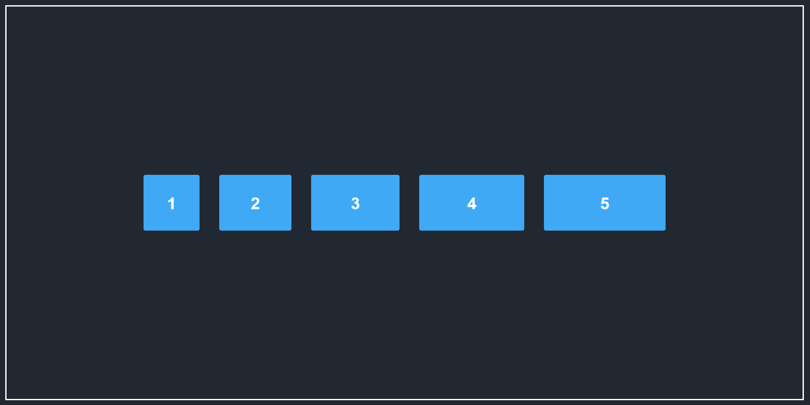

# Flexbox Layout

Welcome to the *Flexbox Layout concept* This project demonstrates how to use CSS Flexbox properties to create dynamic and responsive layouts for web development.

---

## 🌟 Features

- A flexible and responsive container using the CSS `flex` property.
- Various configurations for `justify-content`, `align-items`, and `flex-wrap`.
- Individual flex item properties like `flex-grow`, `flex-shrink`, and `flex-basis` for customization.
- Dynamic layout with clean and modern design.

---

## 🎨 Visual Preview

---

## 📂 Project Structure

| File                | Description                                           |
|---------------------|-------------------------------------------------------|
| `FlexBox.html`        | HTML structure containing a container with flex items. |
| `FlexBoxStyle.css`  | CSS file showcasing different Flexbox properties.      |

---

## 📝 Key Concepts Demonstrated

### 1. **Container Properties**

| Property            | Description                                                  |
|---------------------|--------------------------------------------------------------|
| `display: flex;`    | Defines a flex container enabling Flexbox layout.             |
| `flex-direction`    | Sets the direction of items (`row`, `row-reverse`, `column`, `column-reverse`). |
| `justify-content`   | Aligns items along the main axis (`center`, `space-between`, `space-around`, etc.). |
| `align-items`       | Aligns items along the cross axis (`center`, `stretch`, `baseline`, etc.). |
| `flex-wrap`         | Determines whether items should wrap onto multiple lines.     |

### 2. **Item Properties**

| Property         | Description                                                    |
|------------------|----------------------------------------------------------------|
| `flex-grow`      | Defines how much a flex item will grow relative to others.      |
| `flex-shrink`    | Defines how much a flex item will shrink relative to others.    |
| `flex-basis`     | Sets the initial size of a flex item before any shrinking/growing. |
| `flex`           | Shorthand for `flex-grow`, `flex-shrink`, and `flex-basis`.    |

---

## 🤝 Contributions

Feel free to contribute by:
1. Adding new examples.
2. Enhancing the design.
3. Fixing bugs or adding comments for better clarity.

---

## 📜 License

This project is licensed under the MIT License. Feel free to use and modify it for educational purposes.

---

## 🙌 Acknowledgments

This project is created and maintained by **Ishanvi Chauhan** to simplify and demonstrate Flexbox concepts for learners and developers.
