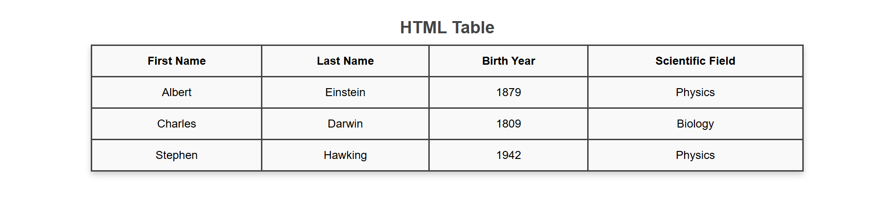

# HTML Table with Styled CSS

This project demonstrates a clean and responsive HTML table styled using external CSS. The table presents data in a basic format with a shadowed layout.

Here is how the styled HTML table looks:

---

## Features

1. **Elegant Design**  
   The table is styled with a modern look and feel using CSS properties like `box-shadow`, and a well-designed header.

2. **Responsive Layout**  
   The table adjusts its width to fit various screen sizes, centered for a balanced appearance.

3. **Organized Code**  
   HTML and CSS are separated for better maintainability and scalability.

---

## Project Structure

- **`Table.html`**  
  Contains the HTML structure of the table, including headers, rows, and data.

- **`TableStyle.css`**  
  Defines the external styles applied to the table, such as borders and spacing.
